<p align="center">
	<!--  -->
	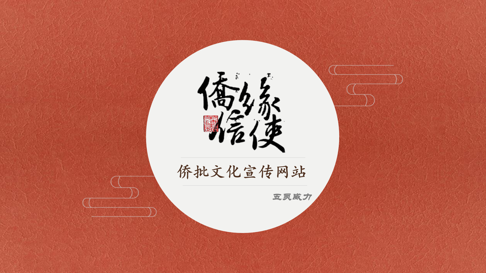
</p>
<h4 align="center">跨越四海，侨缘线牵——侨缘信使，让世界没有距离。</h4>
<p align="center">
	<a href="https://github.com/Chuppch/qiaopi-master-frontend"></a>
    <a href="https://github.com/Chuppch/Qiaopi-master"></a>
    <a href="https://github.com/Chuppch/qio-agent-service"></a>
	<a href="https://github.com/Chuppch/Qiaopi-master"></a>
	<a href="https://github.com/Chuppch/Qiaopi-master?tab=MIT-1-ov-file"></a>
</p>


## 项目介绍

《**侨缘信使**》是一个旨在宣传和传承侨批文化的互动网站。文化内容的数字化呈现、互动性与教育性的结合、情感共鸣的构建以及用户参与的文化共创。我们致力于通过网站，让更多人了解并参与到侨批文化的保护与传承中来，同时为文化带来新的活力。学习侨批文化、体验写侨批、收侨批和漂流瓶等功能，感受慢信文化的魅力，"跨越四海，侨缘线牵——侨缘信使，让世界没有距离。"

平台还引入了智能交互能力作为支撑，使 AI 能够在不同文化语境下参与用户的创作与交流，在情感引导、文化背景补充与内容辅助等方面提供恰当支持，提升整体互动的连贯性与沉浸感。同时，该能力也被应用于平台的管理端，用于辅助内容整理与日常运营，让使平台在保持文化温度的同时更加高效、灵活。
<p align = "right">—— 五灵威力小队</p>

**技术栈**：***JavaScript、Vue2、Vue Router、Pinia、Canvas、Element UI、Webpack、ESLint、Axios***

## **在线体验**

**[侨缘信使🎉](http://110.41.58.26/)**

## 演示图

<table>
    <tr>
        <td colspan="2" align="center"><h3>项目核心玩法</h3></td>
    </tr>
    <tr>
        <td align="center" width="50%">
            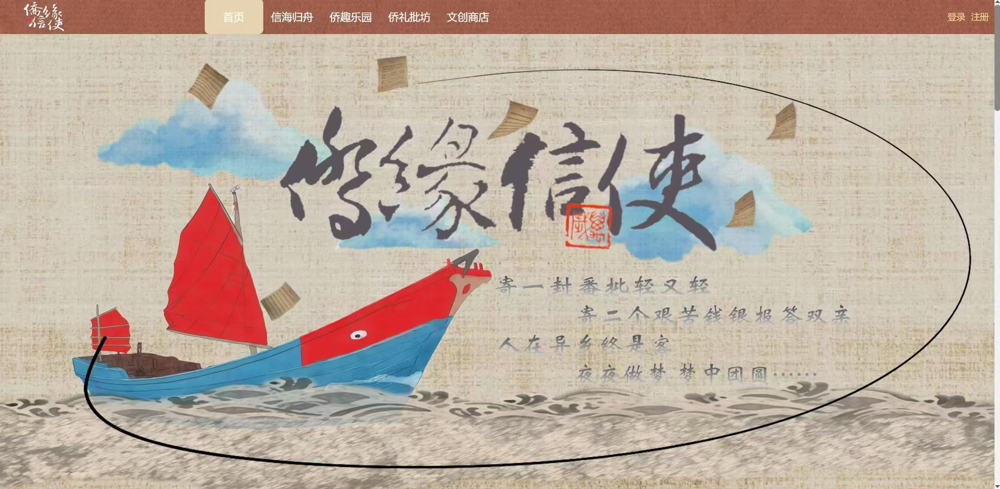
            <br/><small><b>主页</b></small>
        </td>
        <td align="center" width="50%">
            
            <br/><small><b>收信页面</b></small>
        </td>
    </tr>
    <tr>
        <td align="center" width="50%">
            
            <br/><small><b>介绍功能</b></small>
        </td>
        <td align="center" width="50%">
            
            <br/><small><b>历史功能</b></small>
        </td>
    </tr>
    <tr>
        <td align="center" width="50%">
            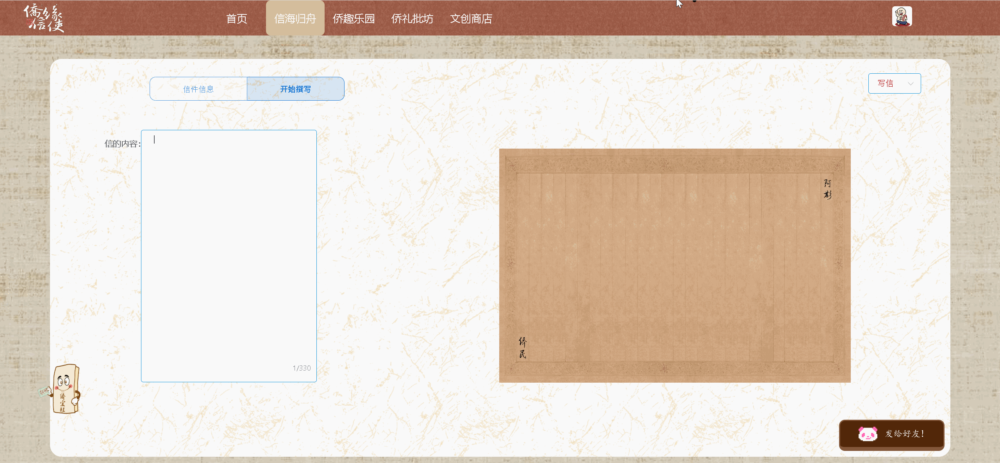
            <br/><small><b>写信功能</b></small>
        </td>
        <td align="center" width="50%">
            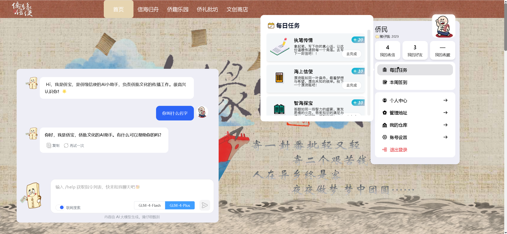
            <br/><small><b>AI导航</b></small>
        </td>
    </tr>
	<tr>
        <td align="center" width="50%">
            
            <br/><small><b>寄信功能</b></small>
        </td>
        <td align="center" width="50%">
            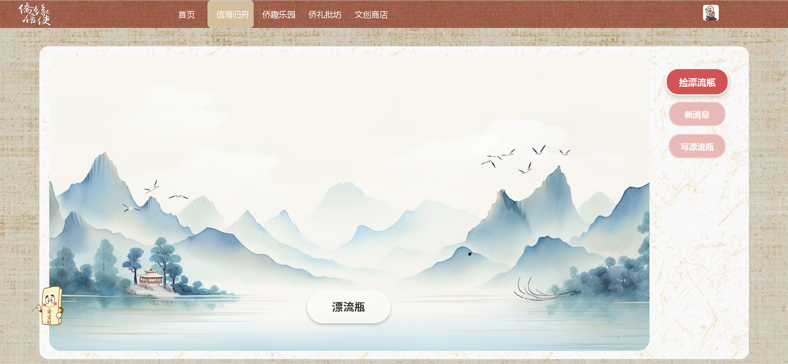
            <br/><small><b>漂流瓶</b></small>
        </td>
    </tr>	 
    <tr>
        <td align="center" width="50%">
            
            <br/><small><b>探索游戏</b></small>
        </td>
        <td align="center" width="50%">
            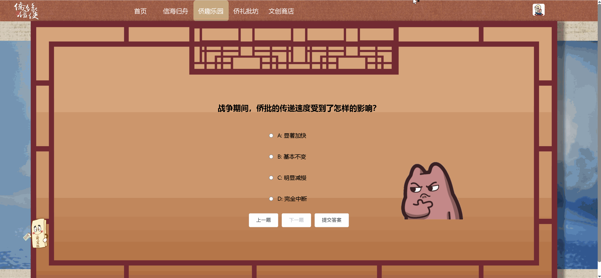
            <br/><small><b>问答游戏</b></small>
        </td>
    </tr>
	<tr>
        <td align="center" width="50%">
            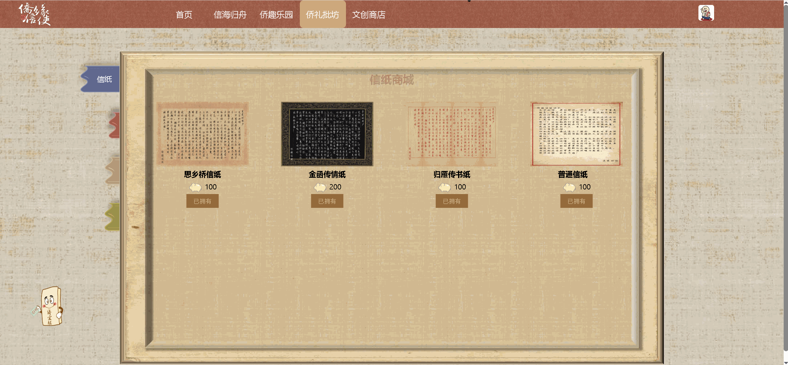
            <br/><small><b>商店</b></small>
        </td>
        <td align="center" width="50%">
            
            <br/><small><b>营销活动</b></small>
        </td>
    </tr>
</table>
<hr style="border: none; border-top: 3px solid #ccc;">

<table>
    <tr>
        <td colspan="2" align="center"><h3>Agent 拖拽配置</h3></td>
    </tr>
    <tr>
        <td align="center" width="50%">
            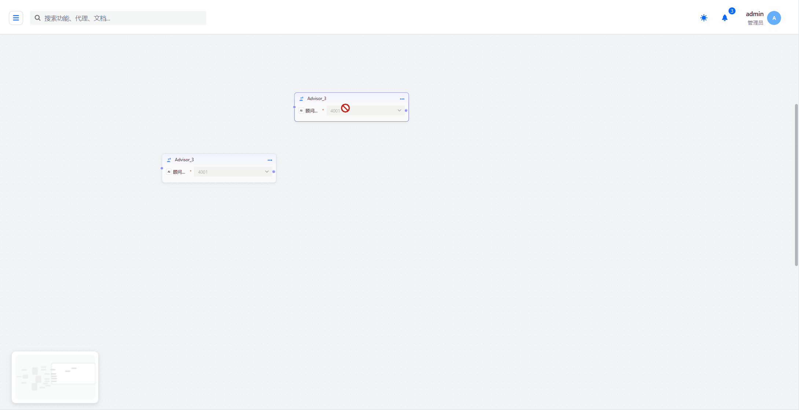
            <br/><small><b>对齐功能</b></small>
        </td>
        <td align="center" width="50%">
            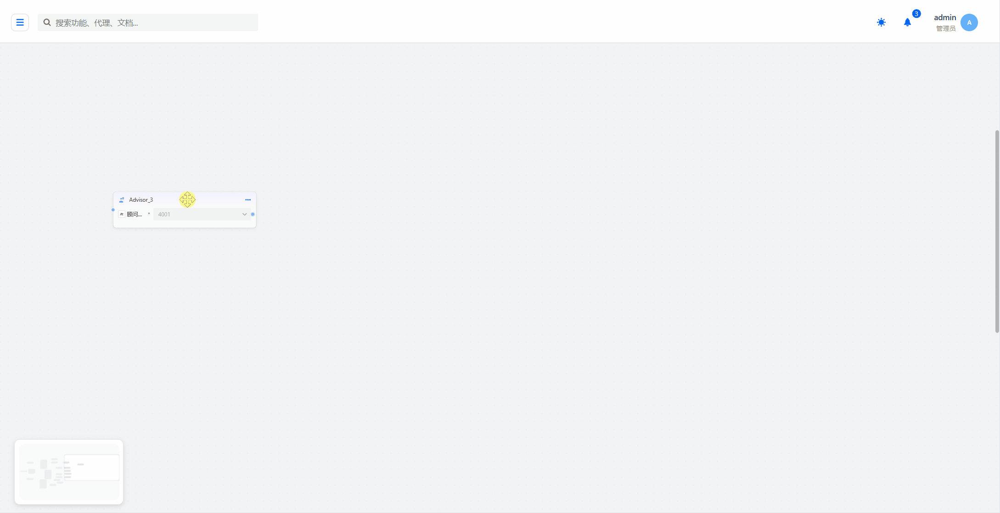
            <br/><small><b>快捷键功能</b></small>
        </td>
    </tr>
    <tr>
        <td align="center" colspan="2">
            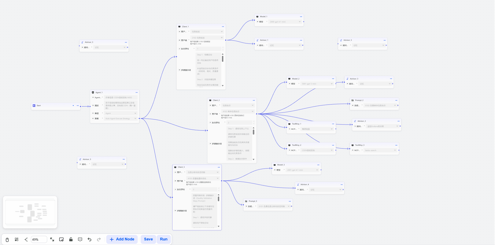
            <br/><small><b>高亮动画</b></small>
        </td>
    </tr>
    <tr>
        <td align="center" width="50%">
            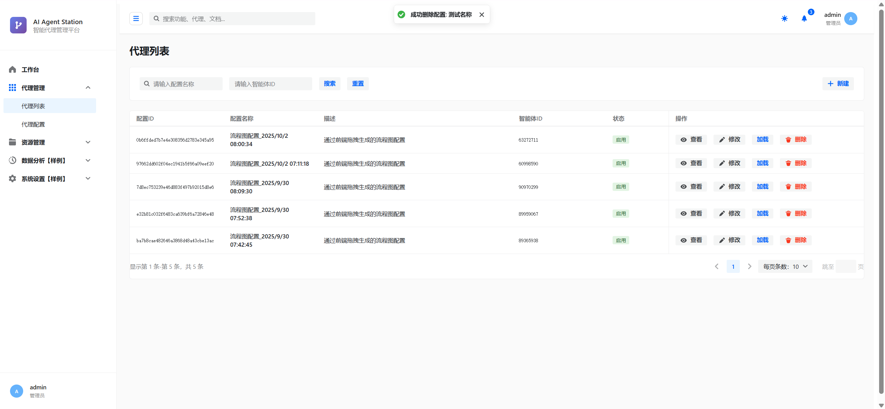
            <br/><small><b>Agent列表</b></small>
        </td>
        <td align="center" width="50%">
            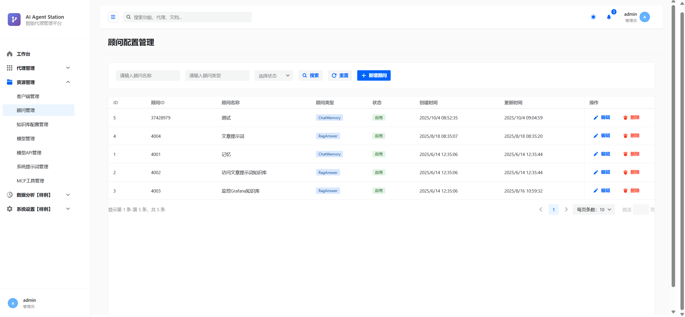
            <br/><small><b>配置页面</b></small>
        </td>
    </tr>
</table>

## 快速部署

拉取后记得在终端 `npm install` ，失败可尝试 `-force`

### 高德地图服务

本项目使用了[高德开放平台API](https://console.amap.com/dev/key/app)，需自行申请，并在 `index.html`中替换

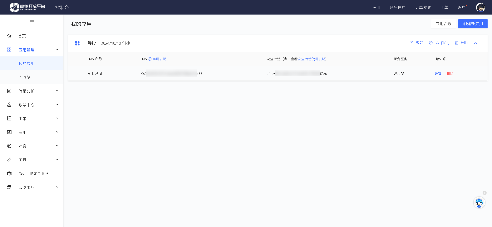

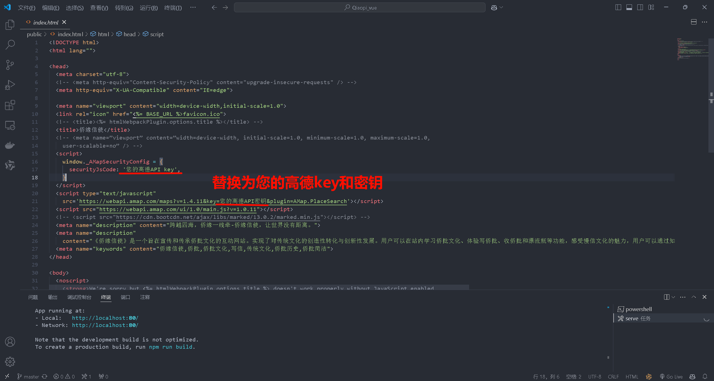

### WebSocket、vue.config.js

项目内多次使用WebSocket和axios请求，需替换后端服务地址为您的后端服务地址

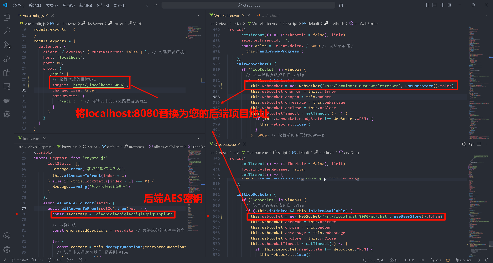

### AES密钥⬆️

需替换AES密钥为您的后端项目设置的AES密钥

### Nginx反向代理

`nginx.conf`配置如下，替换为您的后端服务地址，将`npm run build` 打包后的 `dist` 下的文件移动到nginx的html文件夹即可

```
# Nginx 配置文件

nobody;
worker_processes  1;

# error_log  logs/error.log;
# error_log  logs/error.log  notice;
# error_log  logs/error.log  info;

# pid        logs/nginx.pid;

events {
    worker_connections  1024;
}

http {
    include       mime.types;
    default_type  application/octet-stream;

    #log_format  main  '$remote_addr - $remote_user [$time_local] "$request" '
    #'$status $body_bytes_sent "$http_referer" '
    #'"$http_user_agent" "$http_x_forwarded_for"';

    # access_log  logs/access.log  main;

    sendfile        on;
    # tcp_nopush     on;

    # keepalive_timeout  0;
    keepalive_timeout  65;

    # gzip  on;

    server {
        listen 80;
        server_name  qiaopi;

        gzip on;
        gzip_min_length 1k;
        gzip_comp_level 9;
        gzip_types text/plain application/javascript application/x-javascript text/css application/xml text/javascript application/x-httpd-php image/jpeg image/gif image/png;
        gzip_vary on;
        gzip_disable "MSIE [1-6]\.";

        location / {
            try_files $uri $uri/ /index.html;
            proxy_set_header Host $host;
            proxy_set_header X-Real_IP $remote_addr;
            proxy_set_header X-Forwarded-For $proxy_add_x_forwarded_for;
        }

        location /api/ {
            proxy_pass   http://您的后端服务地址:8080/;
            proxy_set_header Host $host;
            proxy_set_header X-Real_IP $remote_addr;
            proxy_set_header X-Forwarded-For $proxy_add_x_forwarded_for;
        }

        location /ws/ {
            proxy_redirect off;
            proxy_pass http://您的后端服务地址:8080/ws/;
            proxy_set_header Host $host;
            proxy_set_header X-Real_IP $remote_addr;
            proxy_set_header X-Forwarded-For $proxy_add_x_forwarded_for;
            proxy_http_version 1.1;
            proxy_read_timeout 36000s;
            proxy_send_timeout 36000s;
            proxy_set_header Upgrade $http_upgrade;   # 升级协议头 websocket
            proxy_set_header Connection "upgrade";
        }

        error_page   500 502 503 504  /50x.html;
        location = /50x.html {
            root   html;
        }
    }

    server {
        listen 443 ssl;
        server_name 您的后端服务地址;

        # SSL 配置，需申请证书，可使用自签名证书，https://csr.chinassl.net/
        ssl_certificate /www/wwwroot/www/etc/您的后端服务地址.crt;
        ssl_certificate_key /www/wwwroot/www/etc/您的后端服务地址.private;

        # 重定向所有 HTTPS 请求到 HTTP
        # 匹配 MinIO 的路径
        location /qiaopi/ {
            # 重定向所有 HTTPS 请求到 HTTP
            proxy_pass http://您的后端服务地址:9000/qiaopi/;
        }

        location / {
            return 301 http://您的后端服务地址;
        }
    }
}
```


## 未完待续

- [ ] css样式冗余，应提取公共样式，减少体积
- [ ] WebSocket和AES密钥嵌在代码中，不利于维护
- [ ] 部分axios请求未使用request.js，不利于全局处理异常
- [ ] WebSocket重试机制复杂
- [ ] 项目打包仅使用Gzip暴力压缩，仍有其它配置提升首屏加载速度
